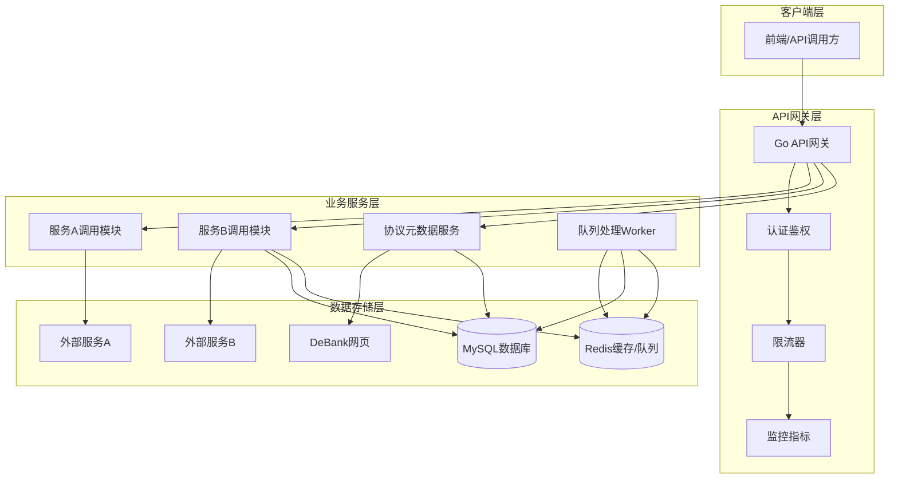

# DeFi资产展示服务 - 架构设计文档

## 1. 系统概述

### 1.1 项目目标
开发一个对标DeBank功能的DeFi资产展示服务，提供用户在DeFi协议中的资产持仓查询功能。

### 1.2 核心功能
1. **服务A集成** - 实时查询有balance概念的协议资产
2. **服务B集成** - 查询无balance概念的协议仓位数据（带缓存）
3. **协议元数据同步** - 定时从DeBank抓取协议信息
4. **实时更新处理** - 通过Redis队列接收服务B的仓位更新

## 2. 整体架构

### 2.1 架构图



### 2.2 架构分层说明

#### 2.2.1 客户端层
- **前端应用**：Web界面或移动端应用
- **API调用方**：第三方服务或开发者

#### 2.2.2 API网关层
- **Go API网关**：统一的API入口
- **认证鉴权**：API密钥验证、用户身份验证
- **限流器**：防止API滥用，按用户/IP限流
- **监控指标**：收集请求指标、性能数据

#### 2.2.3 业务服务层
- **服务A调用模块**：处理有balance概念的协议查询
- **服务B调用模块**：处理无balance概念的协议查询
- **协议元数据服务**：管理协议基础信息
- **队列处理Worker**：处理实时更新队列

#### 2.2.4 数据存储层
- **MySQL**：持久化存储协议数据和仓位数据
- **Redis**：缓存、队列、实时数据存储
- **外部服务A/B**：第三方DeFi数据服务
- **DeBank网页**：协议元数据来源

## 3. 组件设计

### 3.1 服务A调用模块
**职责**：实时查询有balance概念的协议资产

**设计要点**：
- 直接调用外部服务A的API
- 不存储查询结果，实时返回
- 支持批量查询优化
- 实现请求合并和连接池管理

**性能优化**：
- 连接池复用HTTP连接
- 请求超时控制（默认5秒）
- 失败重试机制（最多3次）
- 熔断器保护（失败率超过阈值时熔断）

### 3.2 服务B调用模块
**职责**：查询无balance概念的协议仓位数据

**设计要点**：
- 查询流程：Redis缓存 → 命中返回 → 未命中调用服务B → 存储到MySQL和Redis
- 支持TTL可配置的缓存策略
- 实现数据一致性保证

**缓存策略**：
- 默认TTL：10分钟
- 缓存键格式：`position:{user_address}:{protocol_id}`
- 缓存失效：通过队列更新或手动刷新

### 3.3 协议元数据服务
**职责**：管理协议基础信息

**设计要点**：
- 定时从DeBank网页抓取协议信息
- 支持手动触发同步
- 版本化管理协议数据
- 提供协议搜索和筛选功能

**同步策略**：
- 定时任务：每天凌晨2点执行
- 增量更新：只更新有变化的协议
- 失败重试：最多重试3次，间隔10分钟

### 3.4 队列处理Worker
**职责**：处理服务B的实时仓位更新

**设计要点**：
- 使用Redis Streams作为消息队列
- 多Worker并发处理
- 保证消息至少消费一次
- 失败消息进入死信队列

**消息格式**：
```json
{
  "event_id": "uuid",
  "event_type": "position_update",
  "user_address": "0x...",
  "protocol_id": "aave",
  "position_data": {...},
  "timestamp": 1678886400
}
```

## 4. 数据流设计

### 4.1 实时balance查询流程
```
1. 客户端请求 → API网关
2. API网关 → 服务A调用模块
3. 服务A调用模块 → 外部服务A
4. 外部服务A → 返回balance数据
5. 服务A调用模块 → 格式化响应
6. API网关 → 返回给客户端
```

### 4.2 协议仓位查询流程
```
1. 客户端请求 → API网关
2. API网关 → 服务B调用模块
3. 服务B调用模块 → 检查Redis缓存
   - 缓存命中 → 直接返回
   - 缓存未命中 → 继续
4. 服务B调用模块 → 调用外部服务B
5. 外部服务B → 返回仓位数据
6. 服务B调用模块 → 存储到MySQL
7. 服务B调用模块 → 存储到Redis（TTL: 10分钟）
8. 服务B调用模块 → 返回给API网关
9. API网关 → 返回给客户端
```

### 4.3 协议元数据同步流程
```
1. 定时任务触发 → 协议元数据服务
2. 协议元数据服务 → 抓取DeBank网页
3. DeBank网页 → 返回协议列表
4. 协议元数据服务 → 解析和清洗数据
5. 协议元数据服务 → 对比现有数据
6. 协议元数据服务 → 更新MySQL
7. 协议元数据服务 → 清除相关缓存
```

### 4.4 实时更新处理流程
```
1. 外部服务B推送 → Redis Streams队列
2. 队列处理Worker → 监听队列
3. Worker → 消费消息
4. Worker → 更新MySQL中的仓位数据
5. Worker → 更新Redis缓存
6. Worker → 确认消息消费
```

## 5. 高可用设计

### 5.1 服务高可用
- **API网关**：多实例部署，负载均衡
- **业务服务**：无状态设计，水平扩展
- **Worker**：多实例消费，避免单点故障

### 5.2 数据高可用
- **MySQL**：主从复制，读写分离
- **Redis**：集群模式，数据分片
- **外部服务**：熔断降级，备用方案

### 5.3 容错设计
- **服务降级**：外部服务不可用时返回降级数据
- **熔断保护**：防止级联故障
- **重试机制**：网络波动时自动重试
- **超时控制**：避免长时间阻塞

## 6. 性能优化

### 6.1 缓存策略
- **多级缓存**：内存缓存 + Redis缓存
- **缓存预热**：热点数据提前加载
- **缓存穿透**：布隆过滤器或空值缓存
- **缓存雪崩**：随机TTL，避免同时失效

### 6.2 数据库优化
- **读写分离**：查询走从库，写入走主库
- **分库分表**：按用户地址哈希分片
- **索引优化**：覆盖索引，联合索引
- **连接池**：控制最大连接数

### 6.3 查询优化
- **批量查询**：合并多个用户请求
- **异步处理**：耗时操作异步执行
- **数据压缩**：减少网络传输
- **CDN加速**：静态资源CDN分发

## 7. 监控告警

### 7.1 监控指标
- **业务指标**：请求量、成功率、响应时间
- **系统指标**：CPU、内存、磁盘、网络
- **数据库指标**：连接数、慢查询、QPS
- **缓存指标**：命中率、内存使用、响应时间

### 7.2 告警规则
- **错误率**：API错误率 > 1%
- **响应时间**：P95响应时间 > 2秒
- **服务可用性**：服务不可用 > 5分钟
- **队列积压**：消息积压 > 1000条

### 7.3 日志系统
- **访问日志**：记录所有API请求
- **错误日志**：记录系统异常和错误
- **业务日志**：记录关键业务操作
- **审计日志**：记录数据变更操作

## 8. 安全设计

### 8.1 API安全
- **认证鉴权**：API密钥 + JWT Token
- **访问控制**：RBAC权限模型
- **请求签名**：防止请求篡改
- **频率限制**：防止API滥用

### 8.2 数据安全
- **数据加密**：敏感数据加密存储
- **传输安全**：HTTPS + TLS 1.3
- **数据脱敏**：日志中的敏感信息脱敏
- **访问审计**：记录所有数据访问

### 8.3 网络安全
- **防火墙**：限制不必要的端口访问
- **WAF防护**：Web应用防火墙
- **DDoS防护**：流量清洗和限流
- **漏洞扫描**：定期安全扫描

## 9. 部署架构

### 9.1 开发环境
- **单机部署**：所有服务部署在同一台机器
- **本地数据库**：使用Docker Compose
- **简化配置**：最小化依赖和配置

### 9.2 测试环境
- **独立部署**：与生产环境隔离
- **自动化测试**：CI/CD流水线
- **性能测试**：压力测试和负载测试

### 9.3 生产环境
- **容器化部署**：Docker + Kubernetes
- **多可用区**：跨可用区部署保证高可用
- **自动扩缩容**：根据负载自动调整实例数
- **蓝绿部署**：零停机时间发布

## 10. 技术选型

### 10.1 后端技术栈
- **编程语言**：Go 1.21+
- **Web框架**：Gin或Echo
- **ORM框架**：GORM
- **HTTP客户端**：Go标准库 + 连接池

### 10.2 数据存储
- **关系数据库**：MySQL 8.0+
- **缓存数据库**：Redis 7.0+
- **消息队列**：Redis Streams

### 10.3 基础设施
- **容器编排**：Kubernetes
- **服务发现**：Consul或K8s Service
- **配置中心**：Consul KV或ConfigMap
- **监控系统**：Prometheus + Grafana

### 10.4 开发工具
- **版本控制**：Git
- **CI/CD**：GitHub Actions/Jenkins
- **代码质量**：SonarQube
- **文档工具**：Swagger/OpenAPI

---

**文档版本**：v1.0  
**最后更新**：2026-03-29  
**设计者**：架构设计代理