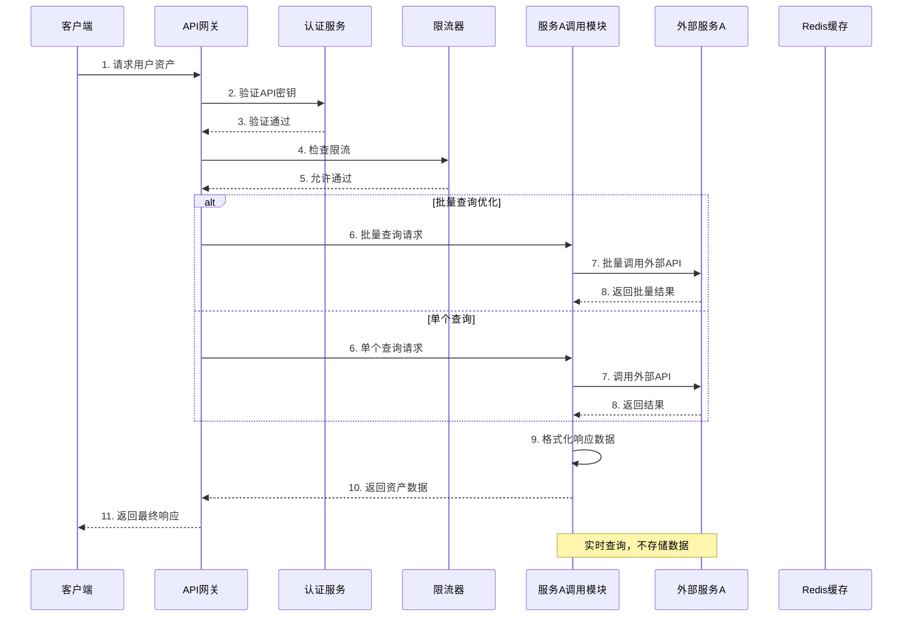
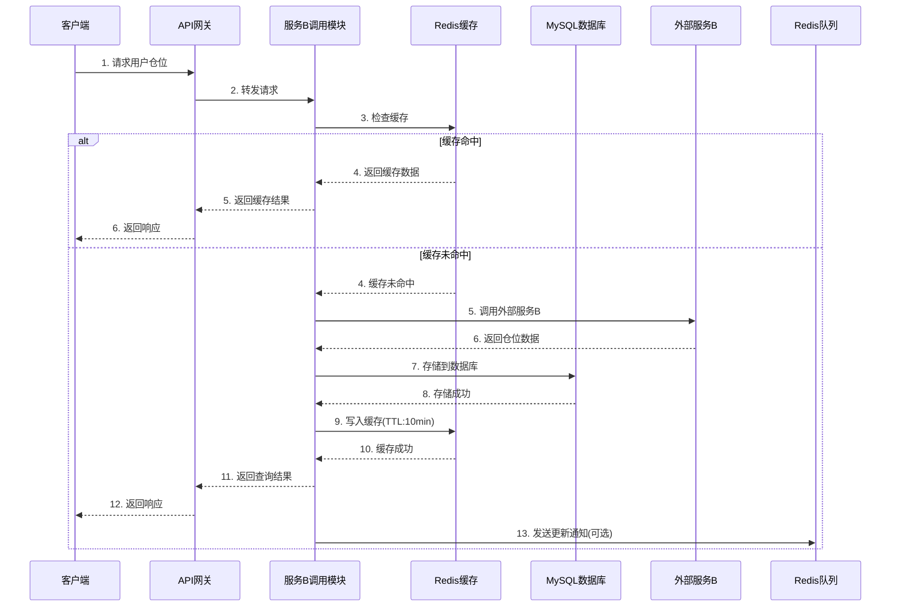
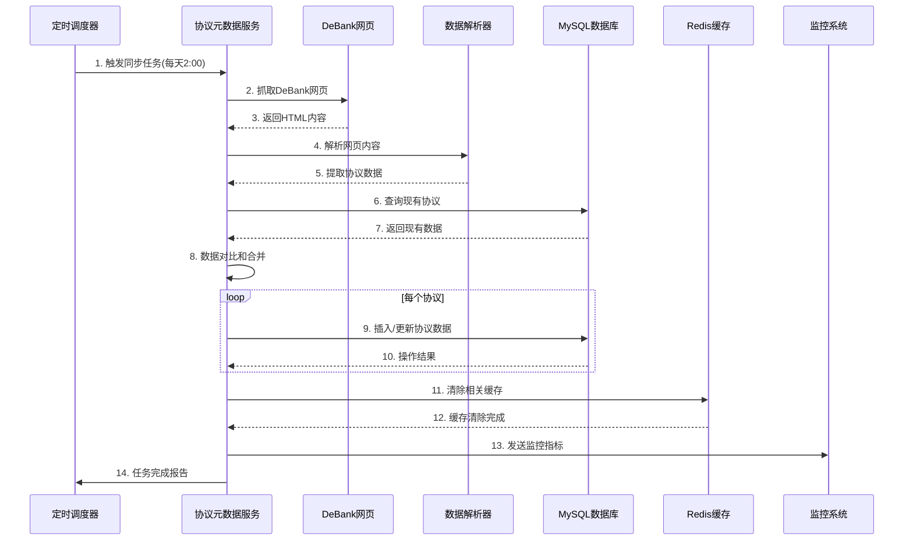
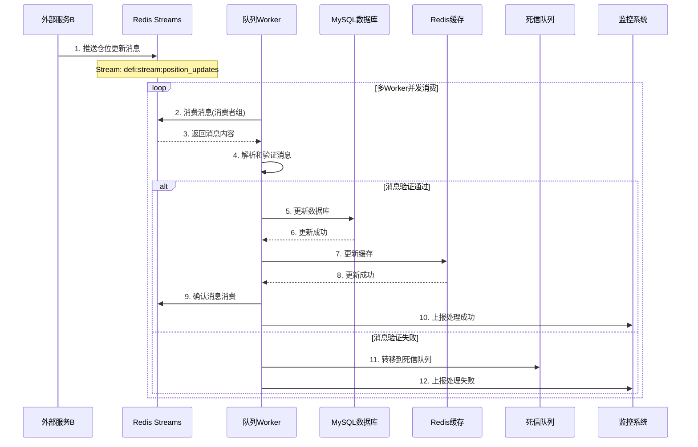

# DeFi资产展示服务 - 组件交互流程设计

## 1. 概述

本文档详细描述DeFi资产展示服务中各个组件之间的交互流程，包括：
1. 服务A调用流程
2. 服务B调用和数据存储流程  
3. 定时同步流程
4. 队列处理流程
5. 错误处理和重试机制

## 2. 服务A调用流程（实时balance查询）

### 2.1 流程图

### 2.2 详细步骤

#### 步骤1-5: 请求验证和限流
1. **客户端请求**: 发送GET请求到 `/users/{address}/assets`
2. **API网关**: 接收请求，解析路径参数和查询参数
3. **认证服务**: 验证API密钥的有效性和权限
4. **限流器**: 检查用户/API密钥的请求频率
5. **请求转发**: 验证通过后转发到服务A调用模块

#### 步骤6-8: 外部服务调用
6. **请求处理**: 服务A模块解析请求参数
7. **外部调用**: 调用外部服务A的API
   - **连接池管理**: 复用HTTP连接
   - **超时控制**: 默认5秒超时
   - **重试机制**: 失败时重试最多3次
   - **熔断保护**: 失败率过高时熔断
8. **响应接收**: 接收外部服务返回的数据

#### 步骤9-11: 响应处理
9. **数据格式化**: 将原始数据转换为标准格式
10. **返回网关**: 将格式化后的数据返回给API网关
11. **最终响应**: API网关添加监控指标后返回给客户端

### 2.3 性能优化
- **批量查询**: 支持多个地址的批量查询，减少网络往返
- **连接池**: HTTP连接池复用，避免频繁建立连接
- **请求合并**: 短时间内相同请求合并处理
- **缓存预热**: 热门用户的资产数据预加载到内存缓存

## 3. 服务B调用和数据存储流程（协议仓位查询）

### 3.1 流程图

### 3.2 详细步骤

#### 步骤1-4: 缓存检查
1. **客户端请求**: 发送GET请求到 `/users/{address}/positions`
2. **请求转发**: API网关验证后转发到服务B模块
3. **缓存键生成**: 根据用户地址和协议ID生成缓存键
   - 格式: `defi:position:{address}:{protocol_id}`
4. **缓存查询**: 查询Redis中是否存在有效缓存

#### 步骤5-6: 外部服务调用（缓存未命中时）
5. **外部调用**: 调用外部服务B的API获取仓位数据
   - **参数验证**: 验证用户地址和协议ID
   - **错误处理**: 处理网络错误和业务错误
6. **数据接收**: 接收并解析外部服务响应

#### 步骤7-10: 数据存储和缓存
7. **数据库写入**: 将仓位数据写入MySQL
   - **事务保证**: 使用事务保证数据一致性
   - **数据清洗**: 清洗和格式化原始数据
8. **存储确认**: 确认数据存储成功
9. **缓存写入**: 将数据写入Redis缓存
   - **TTL设置**: 设置10分钟过期时间
   - **数据结构**: 使用Hash存储结构化数据
10. **缓存确认**: 确认缓存写入成功

#### 步骤11-13: 响应和后续处理
11. **返回结果**: 将查询结果返回给API网关
12. **客户端响应**: API网关返回最终响应给客户端
13. **队列通知**: 可选发送更新通知到Redis队列

### 3.3 数据一致性保证
1. **写后读一致性**: 写入数据库后立即更新缓存
2. **缓存失效策略**: 数据更新时主动删除缓存
3. **版本控制**: 缓存数据带版本号，防止脏读
4. **补偿机制**: 缓存更新失败时记录日志，定时重试

## 4. 定时同步流程（协议元数据同步）

### 4.1 流程图

### 4.2 详细步骤

#### 步骤1-3: 任务触发和数据抓取
1. **定时触发**: 每天凌晨2点触发同步任务
2. **网页抓取**: 使用HTTP客户端抓取DeBank协议页面
   - **User-Agent**: 设置合理的User-Agent
   - **请求频率**: 控制请求频率，避免被封
   - **错误重试**: 失败时重试最多3次
3. **内容获取**: 获取HTML页面内容

#### 步骤4-5: 数据解析
4. **HTML解析**: 使用GoQuery解析HTML结构
5. **数据提取**: 提取协议名称、类别、TVL等信息
   - **数据清洗**: 清理HTML标签和空白字符
   - **格式转换**: 将字符串转换为适当的数据类型
   - **数据验证**: 验证数据的完整性和有效性

#### 步骤6-8: 数据对比
6. **查询现有数据**: 从MySQL查询现有协议数据
7. **获取现有数据**: 获取现有协议的版本和状态
8. **数据对比**: 对比新旧数据，识别变化
   - **新增协议**: 数据库中不存在的协议
   - **更新协议**: 数据有变化的协议
   - **删除协议**: DeBank已下架的协议（标记为不活跃）

#### 步骤9-10: 数据存储
9. **批量操作**: 使用批量插入/更新优化性能
10. **事务保证**: 使用事务保证数据一致性

#### 步骤11-14: 缓存清理和监控
11. **缓存清理**: 清除协议相关的Redis缓存
12. **清理确认**: 确认缓存清理完成
13. **监控上报**: 上报同步任务的指标
   - **同步数量**: 新增、更新、删除的协议数量
   - **执行时间**: 任务总执行时间
   - **错误统计**: 同步过程中的错误
14. **任务报告**: 生成任务完成报告

### 4.3 增量同步优化
1. **版本控制**: 每个协议有版本号，只同步版本变化的协议
2. **变化检测**: 比较关键字段的变化，避免不必要的更新
3. **分批处理**: 大量数据时分批处理，避免内存溢出
4. **断点续传**: 记录同步进度，支持中断后继续

## 5. 队列处理流程（实时更新处理）

### 5.1 流程图

### 5.2 详细步骤

#### 步骤1-3: 消息接收
1. **消息推送**: 外部服务B将仓位更新推送到Redis Streams
   - **消息格式**: JSON格式，包含事件ID、用户地址、协议ID等
   - **消息保证**: 至少投递一次
2. **消息消费**: Worker从消费者组中消费消息
   - **消费者组**: 支持多个Worker并发消费
   - **负载均衡**: 消息自动分配给不同的Worker
3. **消息获取**: 获取消息内容和元数据

#### 步骤4: 消息处理
4. **消息解析**: 解析JSON格式的消息
   - **数据验证**: 验证必填字段和格式
   - **业务验证**: 验证用户和协议是否存在
   - **去重处理**: 检查是否已处理过相同消息

#### 步骤5-8: 数据更新（验证通过时）
5. **数据库更新**: 更新MySQL中的仓位数据
   - **乐观锁**: 使用版本号防止并发更新冲突
   - **部分更新**: 只更新变化的字段
   - **历史记录**: 记录数据变更历史
6. **更新确认**: 确认数据库更新成功
7. **缓存更新**: 更新Redis中的缓存数据
   - **缓存键**: 使用相同的缓存键格式
   - **TTL重置**: 重置缓存的过期时间
8. **缓存确认**: 确认缓存更新成功

#### 步骤9-10: 成功处理
9. **消息确认**: 向Redis Streams确认消息已消费
10. **监控上报**: 上报处理成功的指标
    - **处理延迟**: 消息从产生到处理的时间
    - **处理速率**: 每秒处理的消息数量
    - **成功率**: 消息处理成功率

#### 步骤11-12: 失败处理（验证失败时）
11. **死信队列**: 将失败消息转移到死信队列
    - **失败原因**: 记录失败的具体原因
    - **重试次数**: 记录已重试的次数
12. **失败上报**: 上报处理失败的指标和告警

### 5.3 容错和重试机制
1. **至少一次消费**: 确保消息至少被处理一次
2. **幂等性设计**: 消息处理支持幂等，重复处理不影响结果
3. **死信队列**: 处理失败的消息进入死信队列，人工干预
4. **自动重试**: 临时错误自动重试，永久错误进入死信队列
5. **监控告警**: 队列积压、处理失败时触发告警

## 6. 错误处理和重试机制

### 6.1 错误分类
| 错误类型 | 示例 | 处理策略 |
|----------|------|----------|
| **网络错误** | 连接超时、连接拒绝 | 立即重试，最多3次 |
| **业务错误** | 无效参数、权限不足 | 不重试，直接返回错误 |
| **外部服务错误** | 服务不可用、限流 | 熔断降级，延迟重试 |
| **数据错误** | 数据格式错误、验证失败 | 记录日志，进入死信队列 |
| **系统错误** | 数据库连接失败、内存不足 | 告警通知，人工干预 |

### 6.2 重试策略
1. **立即重试**: 网络抖动等临时错误，立即重试
2. **延迟重试**: 外部服务限流，指数退避重试
3. **最大重试次数**: 每种错误类型设置最大重试次数
4. **重试队列**: 重试消息进入专门的重试队列

### 6.3 熔断降级
1. **熔断器状态**:
   - **关闭**: 正常状态，请求通过
   - **打开**: 错误率超过阈值，拒绝请求
   - **半开**: 尝试恢复，允许部分请求通过
2. **降级策略**:
   - **返回缓存数据**: 外部服务不可用时返回缓存数据
   - **返回默认值**: 无法获取数据时返回安全默认值
   - **简化响应**: 返回简化版数据，保证基本功能

### 6.4 监控和告警
1. **错误率监控**: 监控各接口的错误率
2. **响应时间监控**: 监控P50、P95、P99响应时间
3. **依赖服务监控**: 监控外部服务的可用性
4. **队列监控**: 监控消息队列的积压情况
5. **自动告警**: 错误率超过阈值时自动告警

## 7. 性能优化总结

### 7.1 缓存优化
- **多级缓存**: 内存缓存 + Redis缓存
- **缓存预热**: 热点数据提前加载
- **缓存分区**: 不同数据类型使用不同Redis DB
- **智能TTL**: 根据数据更新频率设置不同的TTL

### 7.2 数据库优化
- **读写分离**: 查询走从库，写入走主库
- **索引优化**: 覆盖索引，联合索引
- **分库分表**: 按用户地址哈希分片
- **连接池**: 控制最大连接数，避免连接泄漏

### 7.3 网络优化
- **HTTP/2**: 使用HTTP/2减少连接数
- **连接池**: HTTP连接池复用
- **压缩传输**: Gzip压缩响应数据
- **CDN加速**: 静态资源使用CDN

### 7.4 并发优化
- **异步处理**: 耗时操作异步执行
- **批量操作**: 合并多个操作减少IO
- **连接复用**: 数据库和Redis连接复用
- **协程池**: 控制并发协程数量

---

**文档版本**: v1.0  
**最后更新**: 2026-03-29  
**设计者**: 架构设计代理